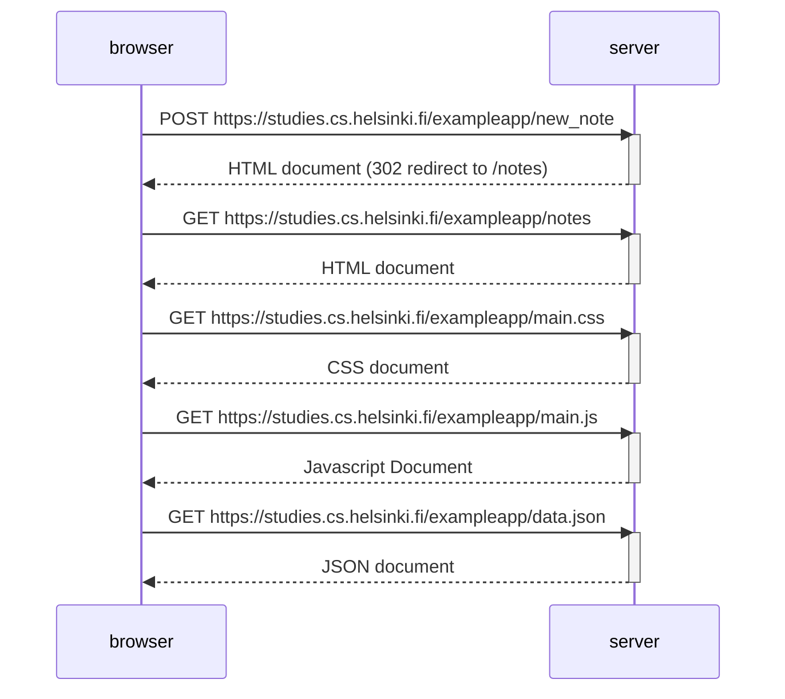

The diagram can be seen using [websequencediagrams](https://www.websequencediagrams.com/) service.
A user click SAVE and...

```mermaid
sequenceDiagram
    participant browser
    participant server

	browser->>server: POST https://studies.cs.helsinki.fi/exampleapp/new_note
	activate server
    server-->>browser: HTML document (302 redirect to /notes)
    deactivate server

	browser->>server: GET https://studies.cs.helsinki.fi/exampleapp/notes
    activate server
    server-->>browser: HTML document
    deactivate server

	browser->>server: GET https://studies.cs.helsinki.fi/exampleapp/main.css
    activate server
    server-->>browser: CSS document
    deactivate server

	browser->>server: GET https://studies.cs.helsinki.fi/exampleapp/main.js
    activate server
    server-->>browser: Javascript Document
    deactivate server

	browser->>server: GET https://studies.cs.helsinki.fi/exampleapp/data.json
    activate server
    server-->>browser: JSON document
    deactivate server

```
